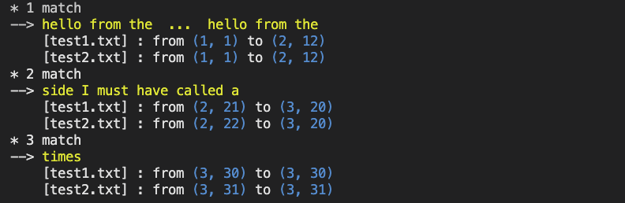

### What is "pattern matcher"?
+ it compares 2 files. the first one be the main. the second be the auxilary.
+ it browses through the main files and finds **the longest identical** sentences which are present in the auxilary file as well
+ it doesn't consider the edited case one. it treats them as multiple different sentences. (ex3)
+ it analyzes files on the token level. 
  a token can be a string consists of digits or alphabets, a special character. a white space can't be a token. so it just skips.(ex4)
  
### How to use it?
  ./match [file1] [file2]

### Examples
1. ex1
  + file1 : ~~hello from the other~~ ~~side~~ at least there? 
  + file2 : hello hello from ~~side~~ hello from the ~~hello from the other~~ 
2. ex2
  + file1 : ~~hello from the~~ ~~other side~~
  + file2 : from the ~~other side~~ ~~hello from the~~
3. ex3
  + file1 : ~~hello~~ from ~~the other side~~
  + file2 : ~~hello~~ to ~~the other side~~
4. ex4
  + file1 : ~~hello $~~~~~~~~$ from the other side~~
  + file2 : ~~hello
            $~~~~~~~~~$from the other side~~

### Program Result
+ file1
  ~~hello from the other side
  hello from the~~ here ~~side
  I must have called a~~ hundred ~~times~~
+ file2
  ~~hello from the other side
  hello from the~~ other ~~side
  I must have called a~~ thousand ~~times~~
+ result  
+ explanation 
  + it shows total matches.
  + for each matches the sentence to be the longest identical is printed out in color.
  + for each files it tells which position the sentence is located in the file. 
  + the number inside the parentheses indicate the line number and column number of the first character from the first and last tokens.
   
### Feedback 
  contact (hooo.dev@gmail.com)
